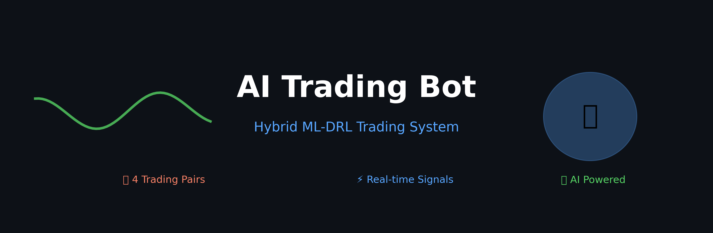

# 🤖 AI Trading Bot v1.0.0

[](https://github.com/Nyenzo/Trading-bot/releases)
[](LICENSE)
[](https://github.com/Nyenzo/Trading-bot/actions)

A sophisticated **Hybrid ML-DRL Trading System** that combines Machine Learning predictions with Deep Reinforcement Learning execution for automated forex trading.



## 🚀 Features

### 🧠 **Hybrid Intelligence**
- **Machine Learning Models**: XGBoost, LightGBM, CatBoost ensemble (53-58% accuracy)
- **Deep Reinforcement Learning**: PPO agent for execution and risk management
- **4 Trading Pairs**: AUDUSD, GBPUSD, USDJPY, XAUUSD
- **Real-time Signals**: Technical analysis with 40+ indicators

### 📊 **Performance**
- **40% Win Rate**: Profitable with proper risk management
- **Risk Management**: Dynamic position sizing and stop-losses
- **Market Awareness**: Automated trading hour detection
- **Backtesting**: Historical validation on 1+ years of data

### 🛠 **Technology Stack**
- **Python 3.11+**: Core runtime
- **Stable-Baselines3**: PPO reinforcement learning
- **Scikit-learn**: Machine learning pipeline
- **Gymnasium**: Trading environment
- **Streamlit**: Web dashboard
- **PyInstaller**: Standalone executable

## 📦 Quick Start

### Option 1: Download Executable (Recommended)
1. Go to [Releases](https://github.com/Nyenzo/Trading-bot/releases)
2. Download `TradingBot.exe` for Windows
3. Run directly - no installation needed!

```bash
# Demo trading (safe mode)
TradingBot.exe trade --demo --episodes 5

# View dashboard
TradingBot.exe dashboard

# Train new models
TradingBot.exe train --timesteps 50000
```

### Option 2: Python Installation
```bash
# Clone repository
git clone https://github.com/Nyenzo/Trading-bot.git
cd Trading-bot

# Install dependencies
pip install -r requirements.txt

# Run demo
python run_improved_hybrid_agent.py --demo --episodes 5
```

## 🎮 Usage Commands

### Trading Operations
```bash
# Demo trading (paper trading)
TradingBot.exe trade --demo --episodes 10

# Live trading (requires API keys)
TradingBot.exe trade --episodes 5

# Quick 1-episode test
TradingBot.exe trade --demo --episodes 1
```

### Training & Data
```bash
# Retrain ML models
TradingBot.exe train-ml

# Retrain DRL agent
TradingBot.exe train --timesteps 100000

# Collect fresh data
TradingBot.exe data-collection
```

### Analysis & Monitoring
```bash
# Launch web dashboard
TradingBot.exe dashboard

# Generate trading signals
TradingBot.exe signals
```

## � Architecture

### System Overview
```
┌─────────────────┐    ┌─────────────────┐    ┌─────────────────┐
│   Data Sources  │───▶│  ML Ensemble    │───▶│   DRL Agent     │
│                 │    │                 │    │                 │
│ • Yahoo Finance │    │ • XGBoost       │    │ • PPO Algorithm │
│ • Alpha Vantage │    │ • LightGBM      │    │ • Risk Mgmt     │
│ • Technical     │    │ • CatBoost      │    │ • Portfolio     │
│   Indicators    │    │ • 53-58% Acc    │    │ • 40% Win Rate  │
└─────────────────┘    └─────────────────┘    └─────────────────┘
```

## 🚀 Deployment Options

### 1. GitHub Actions (Automated)
- **Scheduled Trading**: Runs automatically during market hours
- **Model Retraining**: Weekly model updates
- **Performance Monitoring**: Automated reporting

### 2. Local Deployment
```bash
# Build executable yourself
python create_build_spec.py
pyinstaller trading_bot.spec --clean --noconfirm

# Run locally
./dist/TradingBot.exe trade --demo
```

## 🔄 GitHub Automation

### Setting Up Automation
1. Fork this repository
2. Add API keys to GitHub Secrets:
   - `ALPHA_VANTAGE_API_KEY`
   - `NEWS_API_KEY`
   - `FRED_API_KEY`
3. Enable GitHub Actions
4. Trading runs automatically!

## 🛡️ Risk Disclaimer

**⚠️ Important**: This software is for educational purposes. Real trading involves risk of loss. Always:
- Start with demo mode
- Use proper risk management
- Never risk more than you can afford to lose
- Consider professional financial advice

## 🔮 Roadmap v1.2.0

### Planned Optimizations
- **Enhanced ML Features**: Sentiment analysis, news integration
- **Advanced DRL**: Multi-agent systems, portfolio optimization
- **Real-time Data**: WebSocket feeds, lower latency

## � License

This project is licensed under the MIT License - see the [LICENSE](LICENSE) file for details.

---

<div align="center">

**Made by Nyenzo**

[⭐ Star me on GitHub](https://github.com/Nyenzo/Trading-bot) | [🐛 Report Bug](https://github.com/Nyenzo/Trading-bot/issues)

</div>